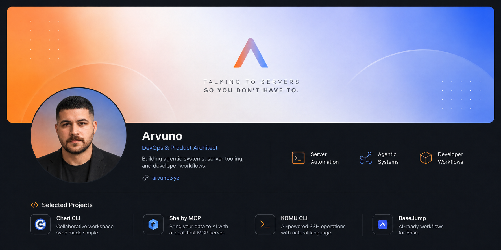

  

<h1 align="center">Arvuno</h1>

  <strong>DevOps & Product Architect</strong> 
  Building agentic systems, server tooling, and developer workflows.

  <em>Talking to servers so you don’t have to.</em>

  
  

---

### Selected Projects

<table>
  <tr>
    <td width="50%">
      <h3>Cheri CLI</h3>
      
Workspace sync for faster collaborative development.

    </td>
    <td width="50%">
      <h3>Shelby MCP</h3>
      
Local-first MCP server for agentic workflows.

    </td>
  </tr>
  <tr>
    <td width="50%">
      <h3>KOMU CLI</h3>
      
AI-powered SSH operations for server teams.

    </td>
    <td width="50%">
      <h3>BaseJump</h3>
      
AI-ready workflow layer for Base projects.

    </td>
  </tr>
</table>

---

### GitHub Stats

  
  

  

