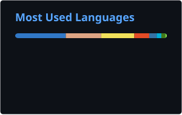

  

<h1 align="center">KartalOps</h1>

  <strong>DevOps · Product Architecture · Agentic Systems</strong>

  Building developer infrastructure, intelligent tooling, and systems designed to scale.

  <em>Talking to servers so you don’t have to.</em>

  <a href="https://kartal.archi">↗ kartal.archi</a>
  &nbsp;&nbsp;·&nbsp;&nbsp;
  <a href="mailto:admin@kartal.archi">✉ admin@Kartal.Archi</a>

---

### Selected Projects

### Selected Projects

<table>
  <tr>
    <td width="50%" valign="top">
      <strong>★ Turpan</strong>
        
      Autonomous code review and engineering intelligence.
    </td>
    <td width="50%" valign="top">
      <strong>★ MirrorUI</strong>
        
      Intelligent interface reconstruction and design tooling.
    </td>
  </tr>
  <tr>
    <td width="50%" valign="top">
      <strong>★ Karbone</strong>
        
      Modern infrastructure and developer automation platform.
    </td>
    <td width="50%" valign="top">
      <strong>★ DataC0</strong>
        
      Data infrastructure and analytics systems for modern teams.
    </td>
  </tr>
</table>
---

### GitHub Stats

  
  

  

